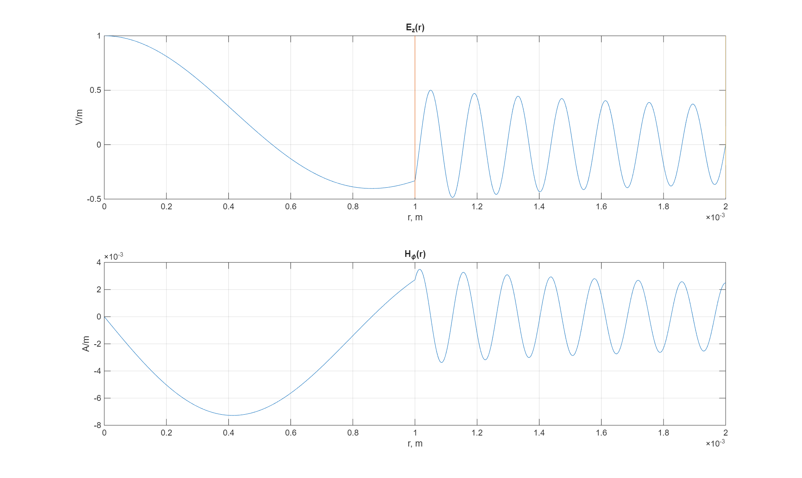

# Optimum design of the Single shot diffraction microscope

This project simulates a Single Shot Diffraction microscope. The aim is to 
find the best waveguide geometry which produces the maximum compression of the electron cloud.


A Single-Shot Diffraction Microscope (SSDM) is an advanced optical imaging system 
designed to capture ultrafast structural information about microscopic objects — 
such as biological samples or nanostructures — using a single ultrashort 
pulse of light, typically from a laser or an X-ray free-electron laser (XFEL).

Figures below shows the motion of electrons in the laser EM field in the waveguide.


The next figure shows how the size of the electron cloud. At 11 ps the size reaches
its minimum.


# How to run

1. Clone the project using one of the following commands:
    ```
    git clone https://github.com/teaprof/Optimum-design-of-Single-Shot-Diffraction-Microscope.git
    ```
    or
    ```
    git clone git@github.com:teaprof/Optimum-design-of-Single-Shot-Diffraction-Microscope.git
    ```
2. Start MATLAB and cd into the project root dir.
3. Initialize MATLAB path with the command:
    ```
    addpath(genpath('.'))
    ```
4. Compile getEBClassicCoder.m to produce getEBClassicCoder_mex.mex file. This can be done by the command:
    ```
    codegen getEBClassicCoder
    ```
5. Run optimMain:
    ```
    optimMain
    ```

# Algorithm

## Waveguide solver

Finding the electromagnetic field in a waveguide is a classic problem in electromagnetics — 
and essential for designing optical or microwave systems, including diffraction microscopes.

Here we consider the cylindrical (circular) waveguide which consists of two layers: vacuum inner layer and dielectrical outer layer.
In this case we know the analytical solution which gives us $\vec{E}$ and $\vec{B}$ (or more precisely, $\vec{H}$) as functions
of polar coordinates and time. We consider only $TM$ modes ($TE$ modes are not considered).

The following figures shows the different modes of EM-waves in the waveguide.





These figures can be reproduced by the command 
```
drawEM
```


## Physics

In this project the motion of the electrons affected by laser electromagnetic
field is simulated. The motion is integrated using Runge-Kutta ode45 integrator.
For right-hand side three alternative approaches are implemented.

1. `rightSideNoInteraction` - no interaction between electrons and classical EM field
2. `rightSideClassic` - with instant interaction between electrons and with classical EM field
3. `rightSideRetarded` - With retarded interaction between electrosna and with classical EM field

There is no special mechanism to switch between these rhs function. To select another physics
the appropriate blocks of the code should be commented or uncommented (see [simElectrons.m](./dynamics/sumElectrons.m)).


### rightSideNoInteraction
This is relatively simple algorithm - just take the waveguide solution for EM field and calculate 
$\vec{F_1} = \vec{E}\cdot q +q [\vec{E} \times \vec{B}]$,
where $E$ and $B$ are the electostatic and magnetic fields at the point where the electron is located.


### rightSideClassic

This rhs part is similar to previous one except that $\vec{E}$ and $\vec{B}$ contains additional terms $E_{ij}$ and $B_{ij}$. $\vec{E}_{ij}$ is the Couloumb electric field of charge $i$
at point where charge $j$ is located and $\vec{B}_{ij}$ is the magnetic field defined by Biot-Savart law for the same pair of charged particles.


Since the computational complexity of this rhs call is $O(n^2)$ where $n$ is the number of electrons, the following implementations
are proposed (see [rightSideClassic.m](./dynamics/rightSide/rightSideClassic.m)):
1. `[E, B] = getFieldClassic(q, r, v)` - uses nested for-loops and scalar computations. This implementation is well tested, compared to known analytical solutions and used
    to test other implementations.
2. `[E, B] = getFieldClassicVectorized(q, r, v)` - inner loop is replaced by vectorized computations
3. `[E, B] = getFieldClassicGPU(q, r, v)` is the GPU port (using MATLAB GPU capabilities)
4. `[E, B] = getFieldClassicCoderMex(q, r, v)` can be compiled to binary code (known as mex file) and used by default.

To compile `getFieldClassicCoderMex` just run `codegen getEBClassicCoder` from the MATLAB command line.

Switching between these implementations can be done by commenting or uncommenting blocks in [rightSideClassic.m](./dynamics/rightSide/rightSideClassic.m).

The following picture shows the performance of different implementations. On my ASUS Z170 Pro with i7-6700K and EVGA GTX1080 mex-based implementation
is slightly faster than others.


This picture can be reproduced on your system by typing a command
````
benchEBClassicVariants
````
This rhs is used by default.

### rightSideRetarded

The difference between this and previous implementation is that this implementation uses retarded potentials while calculating $\vec{E_{ij}}$ and $\vec{B_{ij}}$.
They are called retarded because they depend on the state of the sources at an earlier ("retarded") time — the time when the electromagnetic influence left the source and started traveling toward the observation point.

So, to find $E_{ij}$ and $B_{ij}$ we must find $t_r$ such that $t_r = t - \frac{|\vec{r}_i(t_r) - \vec{r}_j(t)|}{c}$ holds, where $\vec{r}_i(t_r)$ is the position of the $i$-th charged
particle at time $t_r$, $\vec{r}_j(t)$ is the position of $j$-th particle at time $t$, $t$ is the current time, $c$ is the speed of light.

This equaltion implies that we know $\vec{r}_i(t_r)$ function. This function is implemented by the linear interpolation algorithm that uses the list of all
previous locations of $i$th particle.

So, the resulting algorithm is very slow due to two reasons: on each step of Runge-Kutta it finds the zeros of the function defined as the interpolant. Interpolant
is updated after each major step of Runge-Kutta solver which is time consuming too.

By default, the retarded potentials are not used.


# Numerical solvers

## SimMain

`SimMain` is the function that just simulates the motion of the electrons in the waveguide. It produces avi-file with animation. To run this simulation just type
```
simMain
```

## optimMain

This is a main function which optimizes the waveguide geometry. It uses modified multistart method to solve the optimization problem: first it generates a lot of
points and calculates the target function value at each point, then it takes points with best values and runs the local solver from each of them.

The laser should compress the electron cloud and Couloumb interaction between electrons will grow. This leads to stretching of the cloud and decreasing
of the Couloumb forces. So the length of the electron cloud should oscilate if the waveguide is endless. To find optimal solution one should cut off the
waveguide at the position where the length of the cloud reaches the minimum. 

In this project we simulate the flight of electrons during some constant time. The target function (objective function) is the minimum length
of the electron cloud during the simulation time span.

To run optimization process, just type
```
optimMain
```


### Where the results are saved?

See folders `optimresults` (generated by `optimMain`) and `figures` (generated by other scripts).


The present document is partially generated by ChatGPT.

The project was in active phase in 2021-2022.
